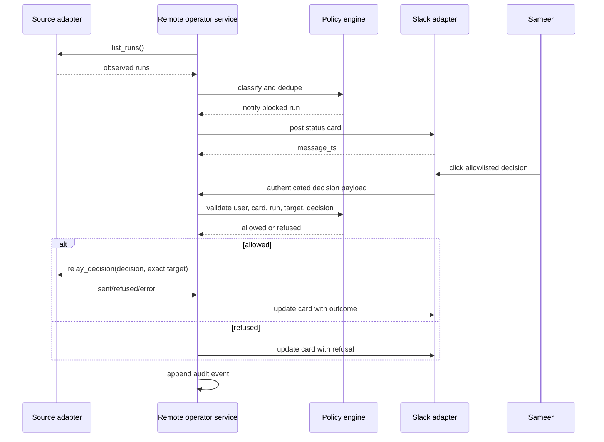

# Remote Operator Mode

Remote operator mode lets Sameer step away from the desk while Hermes watches
known local agent runs and asks for explicit Slack decisions when a run appears
blocked. The service coordinates user-approved decisions; it does not silently
drive agents, invent commands, or bypass the existing approval model.

SAM-1178 is the first vertical slice. It shipped deterministic tmux inventory,
conservative status classification, Slack status cards, and an exact-target
resume bridge for `continue`, `approve_once`, and `deny`. This contract keeps
that slice as the safety baseline for follow-up work.

## Service Boundary

The remote operator service is a separate process with gateway adapter
integration. It observes registered run sources, classifies status, posts Slack
cards, receives authenticated button decisions, and relays only allowlisted
decisions back to the native target adapter.

The service owns orchestration state and audit records. Source adapters own how
to observe or resume their target. Gateway adapters own delivery and user auth.
No component may accept arbitrary user text and turn it into target input.

Out of scope for this contract:

- Building the daemon runtime.
- Adding persistence implementation.
- Changing Slack delivery behavior.
- Extending the action relay beyond allowlisted decisions.
- Approving dangerous commands without the existing approval system.
- Touching payment, auth, client data, or unrelated gateway behavior.

## Components

| Component | Responsibility | Safety boundary |
| --- | --- | --- |
| Inventory collector | Poll enabled source adapters and normalize observed runs. | Read-only. Timeout-bound. Caps per-source results. |
| Status classifier | Convert recent output and source metadata into `running`, `blocked_approval`, `blocked_question`, `blocked_inactivity`, `complete`, or `unknown`. | Conservative: uncertain input becomes `unknown` or `running`, not an action. |
| Policy engine | Decide whether to notify, suppress duplicates, expire stale cards, and allow or refuse actions. | Fail closed on stale sessions, unknown targets, unknown users, or unsupported actions. |
| Slack notifier | Post mobile-first status cards and update cards after decisions. | Reuse Slack allowlists and never include secrets or raw credentials. |
| Action relay | Call the source adapter with a normalized allowlisted decision. | Only relays `continue`, `approve_once`, `deny`, and future explicit allowlist entries. |
| Persistence | Store run observations, cards, decisions, relay attempts, and expirations. | No secrets, tokens, passwords, raw command credentials, or large transcript blobs. |
| Audit log | Append human-readable action records for debugging and review. | Every relayed action includes user id, run id, target id, decision, timestamp, and outcome. |

## Source Adapters

All adapters expose the same conceptual interface:

- `list_runs() -> list[ObservedRun]`
- `classify(run) -> RunStatus`
- `relay_decision(decision) -> ActionResult`

Adapters must validate that a relay request still points to the same live
target observed in the status card.

| Source | First behavior | Relay support |
| --- | --- | --- |
| tmux | Existing SAM-1178 read-only session inventory and pane capture. | Existing exact-target `continue`, `approve_once`, and `deny` only. |
| Hermes background process registry | Observe gateway-launched background processes and completion watcher state. | First follow-up after tmux; relay only where a native approval or resume hook exists. |
| Claude Code | Observe known local Claude sessions through an explicit adapter. | Later ticket; require exact session identity and adapter-level refusal paths. |
| Codex | Observe known local Codex sessions through an explicit adapter. | Later ticket; require exact session identity and adapter-level refusal paths. |

## Data Model

`ObservedRun`

```json
{
  "run_id": "tmux:agent-one",
  "source": "tmux",
  "target_id": "agent-one",
  "status": "blocked_approval",
  "last_output_preview": "Approval required...",
  "observed_at": "2026-05-25T00:00:00Z",
  "metadata": {
    "created": "1710000000"
  }
}
```

Rules:

- `run_id` is stable for a live run and includes the source prefix.
- `target_id` is the exact native target identifier used by the adapter.
- `last_output_preview` is bounded and scrubbed for Slack display.
- `metadata` may contain non-secret identity fields needed for stale-target
  detection, such as tmux creation time.

`StatusCard`

```json
{
  "card_id": "slack:C1:44.55",
  "run_id": "tmux:agent-one",
  "channel_id": "C1",
  "message_ts": "44.55",
  "status": "blocked_approval",
  "posted_at": "2026-05-25T00:01:00Z",
  "expires_at": "2026-05-25T00:11:00Z",
  "resolved_at": null
}
```

`UserDecision`

```json
{
  "decision_id": "dec_01",
  "card_id": "slack:C1:44.55",
  "run_id": "tmux:agent-one",
  "target_id": "agent-one",
  "user_id": "U_ALLOWED",
  "decision": "approve_once",
  "received_at": "2026-05-25T00:02:00Z"
}
```

`ActionAttempt`

```json
{
  "attempt_id": "act_01",
  "decision_id": "dec_01",
  "source": "tmux",
  "target_id": "agent-one",
  "decision": "approve_once",
  "outcome": "sent",
  "message": "Action sent to tmux",
  "attempted_at": "2026-05-25T00:02:01Z"
}
```

## Event Payloads

Events are append-only and safe to log. They contain identifiers, bounded
previews, statuses, and outcomes only.

`operator.run_observed`

```json
{
  "event": "operator.run_observed",
  "run_id": "tmux:agent-one",
  "source": "tmux",
  "target_id": "agent-one",
  "status": "blocked_approval",
  "observed_at": "2026-05-25T00:00:00Z"
}
```

`operator.status_card_posted`

```json
{
  "event": "operator.status_card_posted",
  "card_id": "slack:C1:44.55",
  "run_id": "tmux:agent-one",
  "channel_id": "C1",
  "message_ts": "44.55",
  "posted_at": "2026-05-25T00:01:00Z"
}
```

`operator.user_decision_received`

```json
{
  "event": "operator.user_decision_received",
  "decision_id": "dec_01",
  "card_id": "slack:C1:44.55",
  "run_id": "tmux:agent-one",
  "target_id": "agent-one",
  "user_id": "U_ALLOWED",
  "decision": "continue",
  "received_at": "2026-05-25T00:02:00Z"
}
```

`operator.action_refused`

```json
{
  "event": "operator.action_refused",
  "decision_id": "dec_01",
  "run_id": "tmux:agent-one",
  "target_id": "agent-one",
  "decision": "stop",
  "reason": "decision_not_allowlisted",
  "refused_at": "2026-05-25T00:02:01Z"
}
```

`operator.action_sent`

```json
{
  "event": "operator.action_sent",
  "attempt_id": "act_01",
  "decision_id": "dec_01",
  "run_id": "tmux:agent-one",
  "target_id": "agent-one",
  "decision": "approve_once",
  "sent_at": "2026-05-25T00:02:01Z"
}
```

`operator.timeout`

```json
{
  "event": "operator.timeout",
  "card_id": "slack:C1:44.55",
  "run_id": "tmux:agent-one",
  "reason": "card_expired",
  "timed_out_at": "2026-05-25T00:11:00Z"
}
```

## Persistence Needs

Persistence should be SQLite under the active Hermes home, using
`get_hermes_home()` for profile safety. The minimum tables are:

- `operator_runs`: current and recent observations keyed by `run_id`.
- `operator_cards`: Slack card ids, card expiry, resolved state, and run link.
- `operator_decisions`: authenticated user decisions keyed by card and run.
- `operator_action_attempts`: adapter relay attempts and outcomes.
- `operator_audit_events`: append-only event stream for operator activity.

Retention should keep enough history for debugging recent mobile decisions
without becoming a transcript store. A default of 7 to 14 days is enough for
operational audit unless a later ticket defines a stronger need.

## Safety Invariants

- The service coordinates Sameer-approved decisions, not autonomous control.
- Only allowlisted user decisions can be relayed.
- Arbitrary command injection is not a feature.
- Blind approval is not allowed; every action is tied to a status card and
  current target validation.
- Every relay attempt is traceable to user id, run id, target id, decision,
  timestamp, source adapter, and outcome.
- Unknown users, unknown actions, unknown runs, expired cards, reused targets,
  missing Slack auth, and adapter errors fail closed.
- Event payloads and persistence never store secrets, raw tokens, passwords, or
  credential-bearing command text.
- Source adapters must preserve SAM-1178's exact-target rule: a button decision
  may only affect the target captured in that card after the adapter confirms
  the target is still the same live run.
- Slack buttons are decision controls, not free-form command channels.

## Error Behavior

| Condition | Required behavior |
| --- | --- |
| Stale card or expired session | Refuse the action, keep the audit record, and ask the user to refresh status. |
| Unknown target | Refuse; do not attempt source relay. |
| Ambiguous target | Refuse; do not pick a target by substring or recency. |
| Missing Slack auth or unauthorized user | Ignore or refuse without consuming the card. |
| Unsupported action | Refuse and keep the card usable when appropriate. |
| Source adapter timeout | Mark the observation or action attempt as timeout; do not retry blindly. |
| Relay error | Record `error`, update the Slack card with the safe adapter message, and require a fresh decision before another attempt. |
| Persistence unavailable | Continue read-only observation if safe, but refuse relay because audit durability is missing. |

## Sequence



## Ordered Ticket Sequence

1. SAM-1178: Ship native vertical slice.
   Dependency: none. Status: done as the safety baseline.
2. SAM-1181: Define remote operator service contract.
   Dependency: SAM-1178. Status: this document.
3. Build service skeleton and persistence.
   Dependency: SAM-1181. Create the daemon entry point, config, SQLite schema,
   and audit append path. No new relays.
4. Wire tmux source through the service.
   Dependency: service skeleton. Move SAM-1178 polling/card flow behind the
   service policy engine while preserving exact-target validation.
5. Add Hermes background process source.
   Dependency: service skeleton and tmux service wiring. Observe existing
   gateway background process state before adding any relay behavior.
6. Add timeout and stale-card sweeper.
   Dependency: persistence. Expire cards and refuse stale decisions.
7. Add Claude Code source adapter.
   Dependency: stable service policy and audit events. Start observe-only.
8. Add Codex source adapter.
   Dependency: stable service policy and audit events. Start observe-only.
9. Add operational dashboard or status command.
   Dependency: persisted audit events. Read-only status surface only.

Each ticket must include its own verification and must not broaden relay actions
unless the ticket explicitly updates the allowlist and tests the refusal path.
